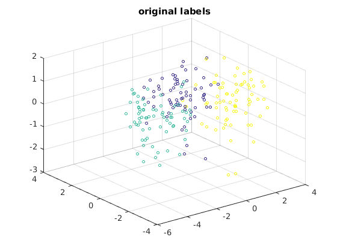
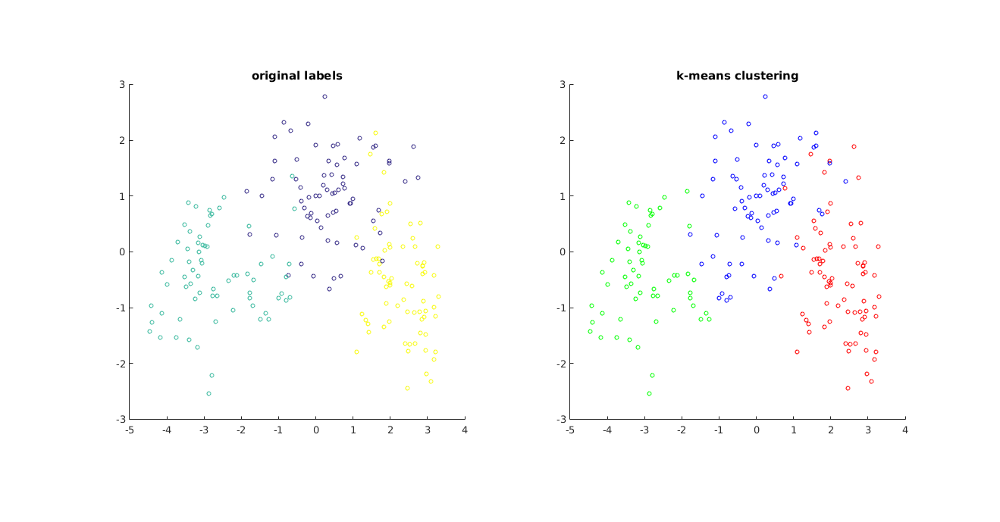

Matseed
--------

- Language: Matlab/Octave
- Algorithm: k-means
- Dataset: seeds

In this example the k-means algorithm have been implemented from scratch in Matlab and applied to a dataset of seeds. The seeds belong to three different varieties of wheat: Kama, Rosa and Canadian. Seven properties have been measured:

1. area A
2. perimeter P 
3. compactness
4. length of kernel
5. width of kernel
6. asymmetry coefficient
7. length of kernel groove

An eighth parameter has been added to the original dataset. The eighth parameter represents the membership to one of the three classes of wheat. I have split that eighth parameter and I used it for comparison. The matlab code use the k-mean algorithm to find the three clusters corresponding to the three varieties of wheat. Because we are dealing with seven-dimensional features, I used the principal component analysis (PCA) to project the dataset in a three and two dimensional space. 

The first part of the software projects the dataset in a three-dimensional space, the original labels (the eighth parameter) have been used to mark each point. The result is shown below:

The second part of the software consists in applying the k-mean algorithm to the original dataset. The algorithm was set with k=3 in order to find the three varieties of wheat. The index generated by the algorithm has been used to create a second three-dimensional plot: 

In the third part of the software, to better understand the result of the algorithm, I have projected the data on a plane: 

Looking to the plot it is possible to appreciate the accuracy of the algorithm. Only few points have been misclassified.

Installation
------------

The code is ready to use. Just clone it and set the folder as your Matlab/Octave workspace, then start the file `run.m`.

Acknowledgment
--------------

Link to the dataset source:

[UCI machine learning repository](http://archive.ics.uci.edu/ml/datasets/seeds)

